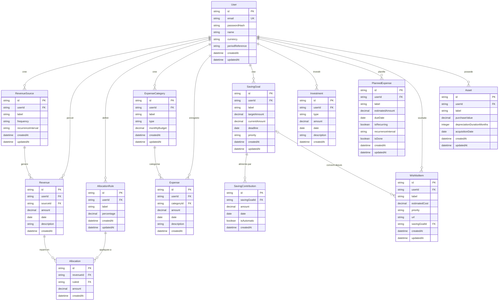

# Schéma de base de données (v1)

Base de données : **SQLite** via **Prisma ORM**

## Diagramme entité-relation

## Description des entités

### User

Utilisateur de l'application. Porte les préférences globales (devise d'affichage parmi USDT/XOF/EUR/USD, période). Toutes les saisies sont en USDT. Toutes les entités métier sont cloisonnées par `userId`.

### RevenueSource

Type de source de revenu créé par l'utilisateur (ex. : "Salaire CDI", "Freelance", "Allocation CAF").

- `frequency` : `RECURRING` ou `ONE_TIME`
- `recurrenceInterval` : `MONTHLY`, `WEEKLY`, `YEARLY`, `null` (si ponctuelle)

### Revenue

Revenu perçu, rattaché à une source. Montant, date de perception et description optionnelle.

### AllocationRule

Règle de répartition définie par l'utilisateur. Chaque règle a un libellé (ex. : "Épargne", "Charges fixes") et un pourcentage. La somme des pourcentages de toutes les règles d'un utilisateur doit faire 100%.

### Allocation

Enregistrement concret d'une répartition : quand un revenu est saisi, une ligne Allocation est créée pour chaque AllocationRule, avec le montant calculé (revenu x pourcentage).

### ExpenseCategory

Catégorie de dépense définie par l'utilisateur.

- `type` : `FIXED` (loyer, abonnements) ou `VARIABLE` (alimentation, loisirs)
- `monthlyBudget` : budget mensuel prévu pour cette catégorie

### Expense

Dépense enregistrée, obligatoirement liée à une catégorie.

### SavingGoal

Objectif d'épargne avec montant cible, échéance optionnelle et priorité (`HIGH`, `MEDIUM`, `LOW`). Le champ `currentAmount` est mis à jour à chaque contribution.

### SavingContribution

Contribution versée vers un objectif d'épargne. Peut être automatique (via répartition) ou manuelle.

### Investment

Opération d'investissement. Le champ `type` est libre (actions, crypto, immobilier, autres).

### PlannedExpense

Dépense future planifiée, ponctuelle ou récurrente. Le champ `isDone` passe à `true` quand elle est réalisée.

- `recurrenceInterval` : `MONTHLY`, `YEARLY`, `null` (si ponctuelle)

### WishlistItem

Achat souhaité à moyen/long terme. Peut être converti en objectif d'épargne (lien via `savingGoalId`).

- `priority` : `HIGH`, `MEDIUM`, `LOW`
- `url` : lien optionnel vers le produit

### Asset

Bien soumis à amortissement linéaire.

- `depreciationDurationMonths` : durée d'amortissement en mois
- Valeur résiduelle calculée dynamiquement : `purchaseValue - (amortissement mensuel x mois écoulés)`
- Amortissement mensuel : `purchaseValue / depreciationDurationMonths`

## Relations clés

- **User -> tout** : chaque entité métier appartient à un utilisateur (cloisonnement)
- **RevenueSource -> Revenue** : un revenu est toujours rattaché à une source
- **Revenue -> Allocation** : un revenu génère N allocations (une par règle de répartition)
- **AllocationRule -> Allocation** : chaque règle est appliquée à chaque revenu
- **ExpenseCategory -> Expense** : chaque dépense est catégorisée
- **SavingGoal -> SavingContribution** : un objectif est alimenté par des contributions
- **SavingGoal <- WishlistItem** : un item wishlist peut être converti en objectif d'épargne

## Flux de données principal

